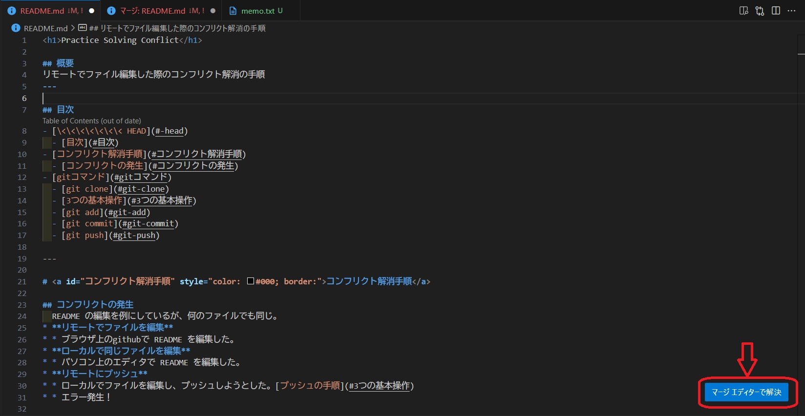

<h1>Practice Solving Conflict</h1>

## 概要
リモートでファイル編集した際のコンフリクト解消の手順
VSCodeのマージエディタを利用してコンフリクトを解消する

---

## 目次
- [コンフリクト発生と解消手順](#コンフリクト発生と解消手順)
  - [1.コンフリクト発生](#1コンフリクト発生)
  - [2.リモートの変更履歴をローカルに引っ張る](#2リモートの変更履歴をローカルに引っ張る)
  - [3.コンフリクトを解消する](#3コンフリクトを解消する)
- [gitコマンド](#gitコマンド)
  - [git clone](#git-clone)
  - [3つの基本操作](#3つの基本操作)
  - [git add](#git-add)
  - [git commit](#git-commit)
  - [git push](#git-push)

---

# <a id="コンフリクト解消手順" style="color: #000; border:">コンフリクト発生と解消手順</a>
  ※ README ファイルでコンフリクトが起こった場合を例に挙げる。<br>他のファイルでも手順は同じ。

## 1.コンフリクト発生
* **リモートでファイルを編集**
  * ブラウザ上のgithubで README を編集した。
<br>

* **ローカルでファイルを編集**
  * ローカルでREADMEを編集し、プッシュした。[プッシュの手順](#3つの基本操作)
  * エラー発生！
    ```
    ! [rejected]        main -> main (fetch first)
    error: failed to push some refs to 'https://github.com/fujitashuichi/practice-solving-conflict.git'
    hint: Updates were rejected because the remote contains work that you do
    hint: not have locally. This is usually caused by another   repository pushing
    hint: to the same ref. You may want to first integrate the remote changes
    hint: (e.g., 'git pull ...') before pushing again.
    hint: See the 'Note about fast-forwards' in 'git push --help'   for details.
    ```

## 2.リモートの変更履歴をローカルに引っ張る
* ローカルで何か編集を行った場合、必ず**ローカルの変更を保存**しておく。
  * ```git add README.md```
  * ```git commit -m "マージ前のコミット"```
<br>

* リモートの変更履歴を取得する。
  * ```git fetch ```
<br>

* リモートの変更をローカルにマージする。
  * ```git merge```
  * コンフリクトによるエラーが発生する。
    ```
    CONFLICT (content): Merge conflict in README.md
    Automatic merge failed; fix conflicts and then commit the result.
    ```
## 3.コンフリクトを解消する
  * マージエディタを使う。
    
    <br>

    * リモートのファイル、ローカルのファイル、マージ予定のファイルの3つが表示される。
      
    <br>

    * ↑リモートとローカルを比較すると、それぞれの変更が矛盾しているのが分かる。
    競合している部分はエディタが強調してくれる。
    <br>

  * **コンフリクト解消**
    * マージエディタで "結果" の部分 （3つある窓の内の下1つ）を編集する。
    
      * コンフリクトがあると、gitはローカルとリモートどちらの変更を優先すればいいか分からなくなる。
      * そこで、上画像のように欲しい変更を組み合わせて、ローカルにマージする。
    <br>

    * 確認してマージ
      * "0個の競合" と表示されているのを確認。
      * "結果" の内容が想定した内容になっているのを確認。
      * "マージの完了" ボタンをクリックする。
    <br>

  * マージコミット
    * "マージの完了" で自動でコミットが行われているか確認する。
      * ```git log``` でコミットされているか確認。
      * コミットされていなかったときや、<ins>※確認が面倒なとき</ins>は、手動でコミットを行う。

      <div style="border: solid 2px #ff0000; margin-top: 15px; padding: 5px 15px;">
        ※ 自分一人のものでないプロジェクトでは、log確認を怠らず、余計なコミットを作らないようにしなくてはならない。
      </div>
    <br>

    * 手動でコミット
      * ```git add README.md```
      * ```git commit -m "FIX: コンフリクト解消後のマージコミット"```
    <br>

  * プッシュ
    * ```git push origin main```
      または
    * "変更の同期" ボタンをクリック

---

# <a id="gitコマンド" style="color: #000;">gitコマンド</a>

## <a id="git-clone">git clone</a>
```git clone <url> ```
* **リモート**（ネット上）のリポジトリを **ローカル**（自分のパソコン上）にコピーする操作。
* 単にコピーするだけでなく接続の設定なども自動で行われる。

## 3つの基本操作
以下の3つのコマンドは、gitの基本操作である。
プッシュするときはこの3つのコマンドをセットで使う。

## <a id="git-add">git add</a>
```git add <files>```
* 例: ```git add *```, ```git add index.html```
* ファイルをgitの **インデックス** に追加する操作。（ステージング）
* **インデックス**: "コミット" したいファイルだけを一時保存する部屋。
* これをしないと、変更の保存ができない。

## <a id="git-commit">git commit</a>
```git commit -m "<message>"```
* 例: ```git commit -m "Fix: ページリンクのずれを修正"```
* "git add" されたファイルのみ、変更を**ローカルに**保存する。
* これをしないと、変更をリモートに保存しようとしても、ローカルにすら保存されていないことになってしまう。また、履歴の管理に影響を及ぼしたりする。


## <a id="git-push">git push</a>
```git push <リモートのブランチ>　<ローカルのブランチ>```
* 例: ```git push origin main``` ```git push origin/html main```<br> ※origin: デフォルトのリモートブランチ
* "git commit" されたファイルのみ、変更を**リモートに**保存する。
